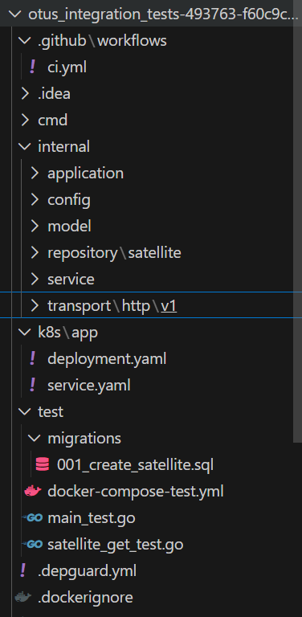
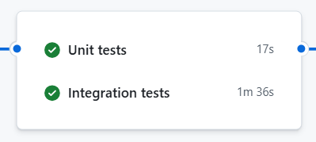
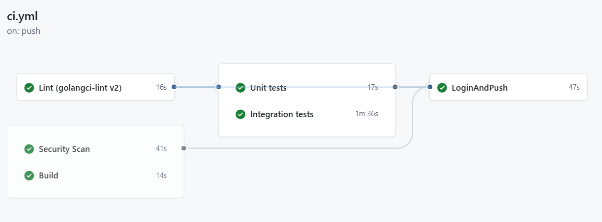
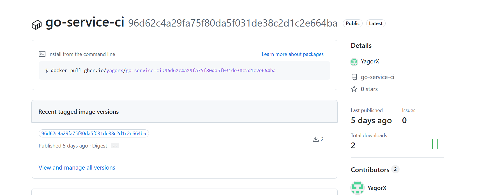
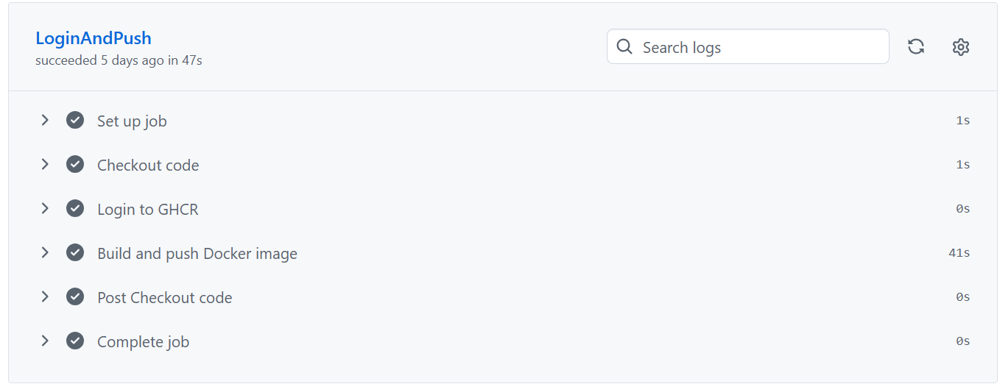
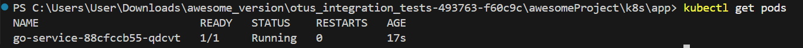
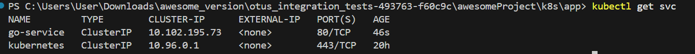
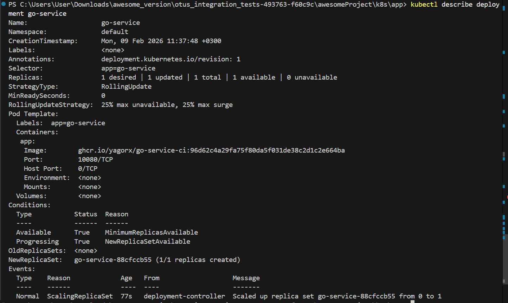
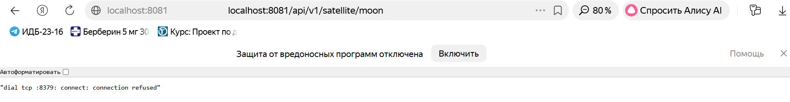

### Структура приложения

Проект организован в соответствии с рекомендациями Go и принципами Clean Architecture.

- `cmd/` — точка входа приложения (main.go).
- `internal/` — внутренняя логика приложения:
  - `application/` — инициализация приложения и зависимостей.
  - `config/` — конфигурация приложения.
  - `model/` — доменные модели.
  - `repository/` — слой доступа к данным.
  - `service/` — бизнес-логика.
  - `transport/http/v1/` — HTTP API (контроллеры).
- `test/` — интеграционные тесты и docker-compose окружение.
- `.github/workflows/` — CI/CD пайплайны GitHub Actions.
- `k8s/app/` — Kubernetes манифесты (Deployment и Service).

Такая структура обеспечивает модульность, тестируемость и изоляцию слоёв приложения.

### Локальная сборка и проверка кода

Для локальной разработки используется Makefile, который унифицирует команды:

- `make lint` — запуск golangci-lint.
- `make unit-test` — запуск unit-тестов с покрытием.
- `make build` — сборка бинарного файла приложения.
- `make test-integration` — запуск интеграционных тестов в docker-compose окружении.

Для статического анализа используется golangci-lint с включёнными линтерами:
govet, errcheck, staticcheck.

### CI/CD пайплайн

CI/CD реализован с использованием GitHub Actions и описан в `.github/workflows/ci.yml`.

Пайплайн состоит из следующих этапов:

1. **Lint**
   - Проверка кода с помощью golangci-lint.
2. **Unit tests**
   - Запуск unit-тестов с покрытием.
3. **Integration tests**
   - Запуск docker-compose окружения (Kafka, PostgreSQL, Redis).
   - Выполнение интеграционных тестов.
4. **Security**
   - Проверка уязвимостей с помощью gosec и govulncheck.
5. **Build**
   - Сборка Go-приложения.
6. **Build & Push Docker image**
   - Сборка Docker-образа.
   - Публикация образа в GitHub Container Registry (GHCR).

Каждый этап выполняется автоматически при push и pull request в ветки `main` и `master`.

### Docker-образ приложения

Приложение упаковано в Docker-образ с использованием multi-stage сборки:

- Stage `builder`:
  - Сборка Go-бинарника в Alpine-образе.
  - Отключён CGO, используется статическая сборка.
- Runtime stage:
  - Используется distroless образ `gcr.io/distroless/base-debian12`.
  - Минимальный размер и повышенная безопасность.
  - Приложение запускается от non-root пользователя.

Образ публикуется в GitHub Container Registry.

### Registry

Docker-образ публикуется в GitHub Container Registry (ghcr.io).

Аутентификация выполняется автоматически в CI/CD с использованием `GITHUB_TOKEN`.
Тег образа соответствует SHA коммита.

### Деплой в Kubernetes

Для запуска приложения используется Kubernetes (minikube).

Созданы манифесты:
- Deployment — развёртывание приложения.
- Service — публикация приложения внутри кластера.

Контейнер загружается из GHCR с использованием imagePullSecrets.

### Проверка работы приложения

После деплоя приложение доступно внутри кластера Kubernetes.
Работа сервиса подтверждена HTTP-запросами.

